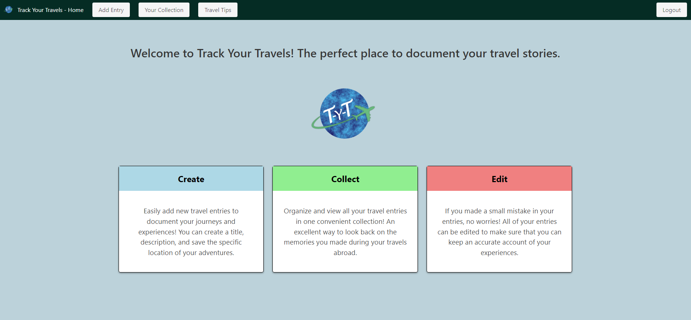

# Track-Your-Travels

## Description

This project was completed for the Columbia Coding Bootcamp. The purpose of this project was to create a travel blog application that allows users to document their travel experienced by making posts including a title, a description of what they did at each location, and an interactive map showing the location they visited. Users are able to view or update their entries, as well as view a page of travel tips.

## Installation

N/A

## Usage

This project is being deployed on Render at the following URL: [https://track-your-travels.onrender.com](https://track-your-travels.onrender.com). 

## Credits

We referenced previous projects and examples from the Columbia University Coding Bootcamp to assist in creating this page. This project was created by Bo Amarant, Erkan Okten, and Briana Gil.

## Features

The application allows users to enter travel blog entries based on their travel experiences. Users can enter a title, a description of what they did at the location, and user an interactive map to select and save the location they visited. After creating an entry, users can visit the collection page to see the entries they have already created, and can choose to edit or delete those entries. There is sign up, log in and log out functionality to allow entries to be specific to users. Additionally, we have a page for travel tips to give users advice for how to make the most out of their travels.

## Screenshot of Deployed Application

